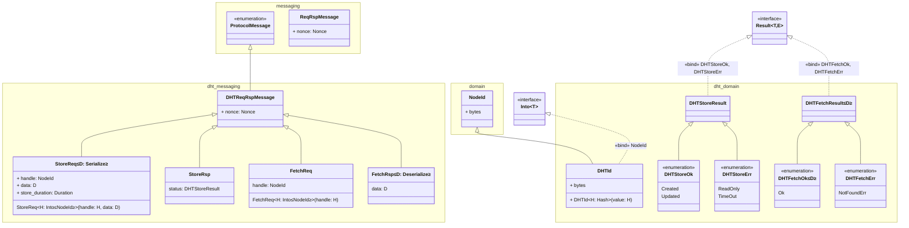
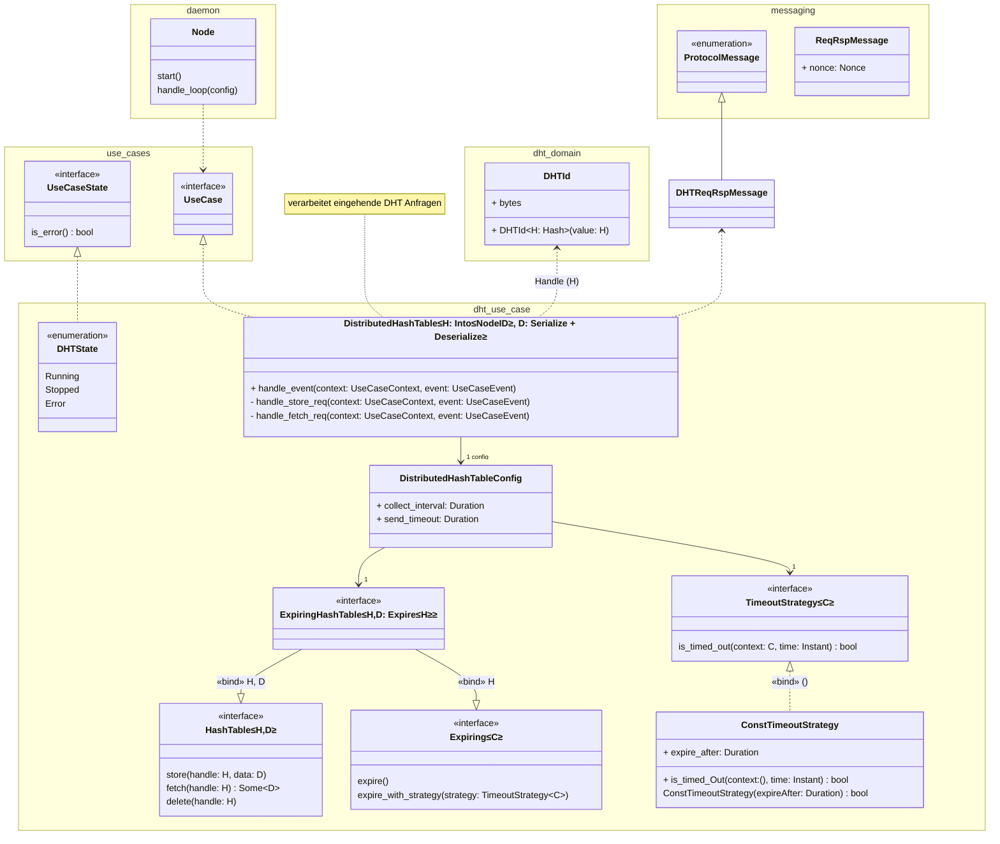
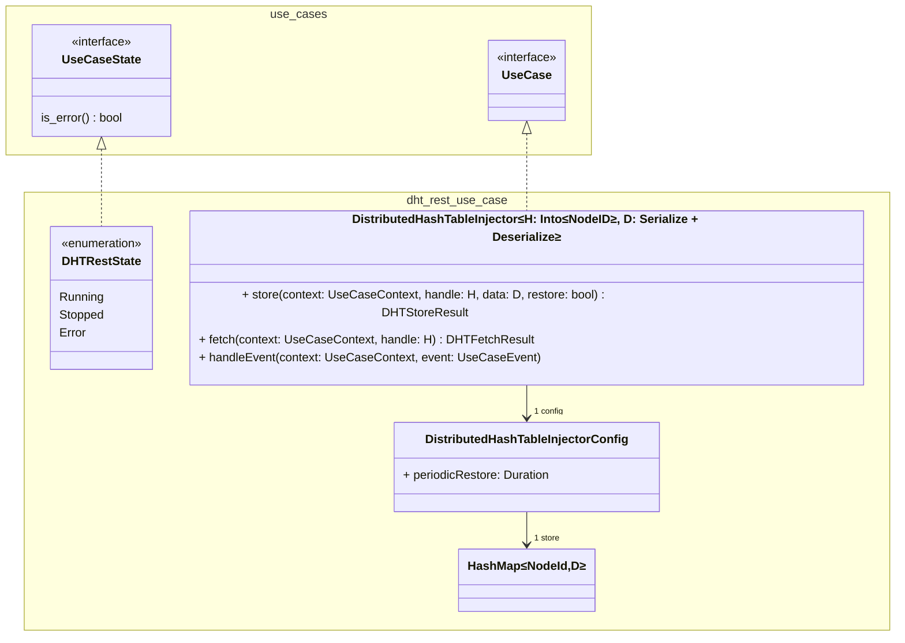

# Entwurf DHT #

## Grundsätzliches zum Entwurf ## 

- kein reines UML
- unter anderem Vereinfachungen, wie dass Template-Bindings weggelassen wurden 
- als Workaround für einen [Mermaid Bug](https://github.com/mermaid-js/mermaid/issues/4578)
  wurden teilweise `≤` bzw. `≥` im Entwurf als identische Bedeutung für Typ-Parameter verwendet

## Neue Protokollnachrichten und Erweiterung der Domain ##

## Neue Use Cases ##

### 1. DistributedHashTable ###

#### Anmerkungen: ####

- verantwortlich für das **Reagieren** auf Netzwerknachrichten
- **nicht** verantwortlich für Neu-Publizieren, um Werte am Leben zu halten

---

### 2. Distributed Hash Table Access over REST ###

#### Anmerkungen: ####

- Zugriff auf DHT über REST-Schnittstelle
- versendet initiale Store-Request
- hält Werte am Leben, falls gewollt

