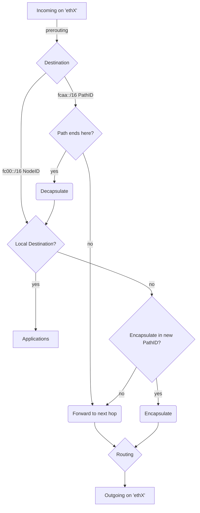
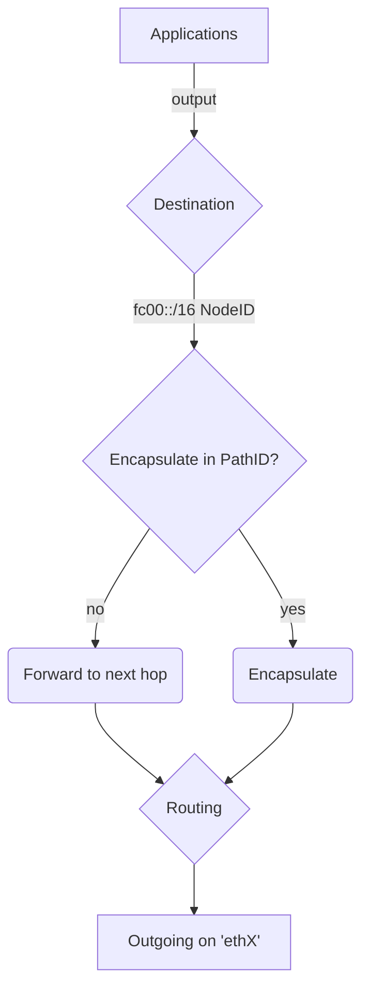

# Overview
In this experiment the KIRA Forwarding Tier is implemented using the capabilities of the [netfilter](https://www.netfilter.org/) project and the linux routing table.

This way, all forwarding traffic is handled efficiently in kernelspace while paths can be set up and destroyed from the userspace routing tier.

Currently all communication with the kernel is handled by calling the `nft` and `ip` binaries to set up packet mangling, updating paths and modifying the routing table.

# Explanation
The following mappings must be provided by the routing tier:
1. NodeID -> PathID + outgoing network interface:
    * Every established path to a particular NodeID must be configured in the forwarding tier.
2.  All PathIDs for paths that terminate at this node.
    * All incoming packets with a matching PathID will be decapsulated.
3. PathID -> PathID
    * Every matching imcoming packet will simply be forwarded to the next hop according to the mapping provided.
    * This is implemented with a nftables map.

## Encapsulation/Decapsulation
Traffic from local processes with a NodeID destination (`fc00::/16`) may be encapsulated.
To achieve this the traffic is routed through an `ip6gre` dummy interface. 
There the inner IPv6 packet is encapsulated in a GRE IPv6 packet with destination address `fcaa::/16`. 
This outer IPv6 packet may be forwarded at the next hop until it reaches its destination. 
At the destination node the packet is again sent routed through a dummy ip6gre interface and the inner IPv6 packet is decapsulated. 
The packet can now be processed by an application or be forwarded to a physical neighbor.

## Packet flow for incoming traffic

This diagram depicts the flow of incoming packets on the physical network interfaces. 
Only the traffic relevant for KIRA is shown.
If a packet can not be forwarded because it does not match any mappings provided by the routing tier it is dropped.

## Packet flow for local traffic

This diagram depicts the flow of packets generated locally by applications communicating via KIRA.
Again only traffic relevant for KIRA is shown.
Traffic that can not be forwarded will be dropped.


### Netfilter flow for reference


# Usage
## Prerequisites
- The kernel module `ip6gre` must be available
- IPv6 must be enabled and a subnet needs to be configured for the docker daemon
([Docker Documentation](https://docs.docker.com/config/daemon/ipv6/), [`daemon.json`](daemon.json))

## Configuration
- Containers must be deployed with capability NET_ADMIN to allow access to nftables
- IPv6 must be explicitly enabled for container
- IPv6 forwarding must be enabled for container
- A Docker IPv6 network must be setup

## Containernet examples
A few simple containernet tests are included in [tests](tests).

To run the encapsulation test execute:
```sh
python3 encapsulation.py
```
Inside the containernet shell run:
```sh
d1 ping -I fc00::1 fc00::2
```
Encapsulation and decapsulation is handled transparently.
To observe the flow of encapsulated packets first attach another shell to the container:
```sh
docker exec -it nm.d1 bash
```
Then packet flow can be observed with
```sh
tcpdump -n -i any
```
Additionally nftables tracing can be used to monitor nftables activity.
```sh
nft monitor
```

## Utilities & Development
To display and modify the interface configuration the `iproute2` package is installed:
```sh
ip addr show
```
To view the loaded `nftables` configuration run:
```sh
nft list ruleset
```
The configuration is included in the container in `/nftables.conf`. It can be modified and loaded with:
```sh
nft delete table ip6 kira
nft -f /nftables.conf
```
Nftables tracing is enabled so packets flowing through the configured rules can be observed with:
```sh
nft monitor
```
Tcpdump is installed so all traffic can be observed with:
```sh
tcpdump -i any -n
```

# TODO
- [ ] fix PathIP forwarding
- [ ] use lower level interfaces than ip and nft binaries
- [ ] forwarding to physical neighbors
- [ ] integrate forwarding into rust prototype
