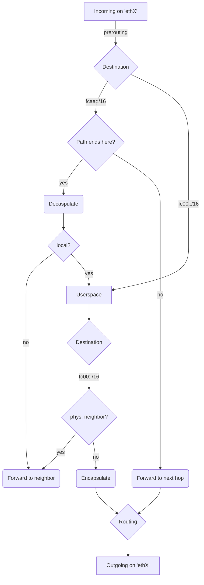

# Overview
In this experiment the KIRA Forwarding Tier is implemented using the capabilities of the [netfilter](https://www.netfilter.org/) project and the linux routing table.

This way, all forwarding traffic is handled efficiently in kernelspace while paths can be set up and destroyed from the userspace routing tier.

Currently all communication with the kernel is handled by calling the `nft` and `ip` binaries to set up packet mangling, updating paths and modifying the routing table.

# Explanation
The following mappings must be provided by the routing tier:
1. NodeID -> PathID + outgoing network interface:
    * Every established path to a particular NodeID must be configured in the forwarding tier. 
    * This can be done efficiently by modifying a single [nftables named map](https://wiki.nftables.org/wiki-nftables/index.php/Maps)
2.  All PathIDs for paths that terminate at this node.
    * All incoming packets with a matching PathID will be decapsulated.
    * This can be done efficiently by modifying a [nftables named set](https://wiki.nftables.org/wiki-nftables/index.php/Sets)
3. PathID -> PathID
    * Every matching imcoming packet will simply be forwarded to the next hop according to the mapping provided.
    * This is also implemented with a nftables map.

## Encapsulation/Decapsulation
All local traffic addressed to other Nodes (`fc00::/16`) is routed through an `ip6gre` dummy interface. There the inner IPv6 packet is encapsulated in a GRE IPv6 packet with destination address `fcaa::/16`. This outer IPv6 packet may be forwarded at the next hop until it reaches its destination. At the destination node the packet is again sent routed through a dummy ip6gre interface and the inner IPv6 packet is decapsulated. The packet can now be processed by an application or be forwarded to a physical neighbor.

## Packet flow


### Netfilter flow for reference


# Usage
## Prerequisites
- The kernel module `ip6gre` must be available
- IPv6 must be enabled and a subnet needs to be configured for the docker daemon
([Docker Documentation](https://docs.docker.com/config/daemon/ipv6/), [`daemon.json`](daemon.json))

## Configuration
- Containers must be deployed with capability NET_ADMIN to allow access to nftables
- IPv6 must be explicitly enabled for container
- IPv6 forwarding must be enabled for container
- A Docker IPv6 network must be setup

## Example
1. Copy the included `daemon.json` to `/etc/docker/daemon.json`:
```sh
cp daemon.json /etc/docker/daemon.json
```
2. Reload the docker daemon to enable IPv6:
```sh
systemctl reload docker
```
3. Build provided container test image:
```sh
docker build -t test .
```
4. Create a docker network:
```sh
docker network create --ipv6 --subnet="fcaa::/16" --gateway="fcaa::1" test
```
5. Start a container and attach to it:
```sh
docker run --rm -it --cap-add NET_ADMIN --network test --ip6 fcaa::2 \ 
--sysctl net.ipv6.conf.all.disable_ipv6=0 \ 
--sysctl net.ipv6.conf.all.forwarding=1 \ 
test "fc00::2" bash
```
The container above will have the NodeID `fc00::2`. For testing purposes the container is assigned the "PathID" `fcaa::2`. This way connectivity can be tested easily without a more elaborate setup.

More containers can be started, but the PathID and NodeID have to be modified in the `docker run` command.

Inside the container, the `ip6gre` interface is automatically configured and brought up. 
The `nftables` ruleset is automatically loaded. However the mappings are not automatically populated.

To add a PathID -> PathID mapping run:
```sh
./pathtopath.sh <incoming> <outgoing>
```
To add a NodeID -> PathID mapping run:
```sh
./nodetopath.sh <destination node> <destination path>
```
To mark a PathID as terminating on this host run:
```sh
./localpath.sh <path>
```
---

### Testing Encapsulation and Decapsulation:
Note: This example doesn't use PathIDs in the intended way. There is no proper generation of PathIDs or forwarding, this is for testing purposes only.

Create a docker network:
```sh
docker network create --ipv6 --subnet="fcaa::/16" --gateway="fcaa::1" test
```

For this experiment two seperate containers need to be started.
```sh
docker run --rm -it --cap-add NET_ADMIN --network test --ip6 fcaa::2 \ 
--sysctl net.ipv6.conf.all.disable_ipv6=0 \ 
--sysctl net.ipv6.conf.all.forwarding=1 \ 
test "fc00::2" bash
```

```sh
docker run --rm -it --cap-add NET_ADMIN --network test --ip6 fcaa::3 \ 
--sysctl net.ipv6.conf.all.disable_ipv6=0 \ 
--sysctl net.ipv6.conf.all.forwarding=1 \ 
test "fc00::3" bash
```

In container 1 (with NodeID `fc00::2`) the path with PathID `fcaa::2` needs to marked as ending on this host:
```sh
./localpath.sh fcaa::2
```
A mapping from destination NodeID `fc00::3` to PathID `fcaa::3` needs to be created:
```sh
./nodetopath fc00::3 fcaa::3
```

Repeat the procedure in container 2:
```sh
./localpath.sh fcaa::3
```
```sh
./nodetopath fc00::2 fcaa::2
```

Pinging the other NodeID should now work! In Container 1 run:
```sh
ping fc00::3
```

---

### Utilities & Development
To display and modify the interface configuration the `iproute2` package is installed:
```sh
ip addr show
```
To view the loaded `nftables` configuration run:
```sh
nft list ruleset
```
The configuration is included in the container in `/nftables.conf`. It can be modified and loaded with:
```sh
nft delete table ip6 kira
nft -f /nftables.conf
```
Nftables tracing is enabled so packets flowing through the configured rules can be observed with:
```sh
nft monitor
```

# TODO
- [] :exclamation: fix PathID forwarding (currently conflicting rules -> set & match fwmark?)
- [] forwarding to physical neighbors
- [] containernet integration
- [] integrate forwarding into rust prototype
