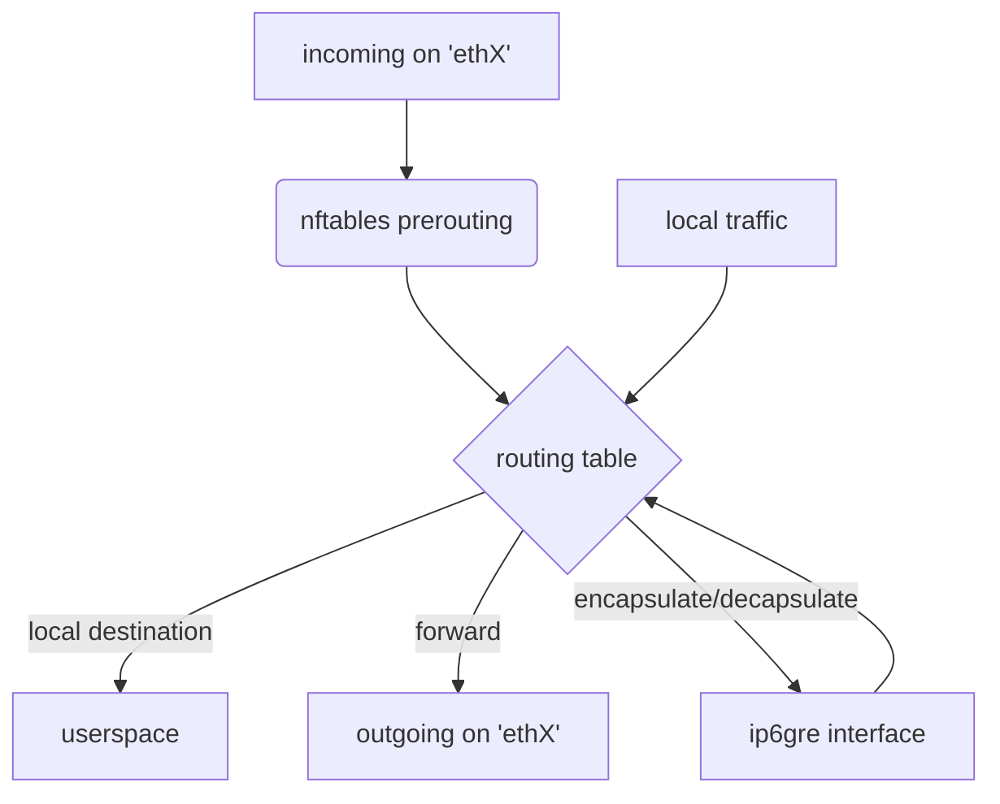

# Overview
The KIRA Forwarding Tier is implemented using the capabilities of the [netfilter](https://www.netfilter.org/) project and the linux routing table.

This way, all forwarding is handled efficiently in kernelspace while paths can be set up and destroyed from the userspace routing tier.

Currently all communication with the kernel is handled by calling the `nft` and `ip` binaries to set up packet mangling, updating paths and modifying the routing table.

# Explanation
The following mappings must be provided by the routing tier:
1. NodeID -> PathID + outgoing network interface:
    * Every established path to a particular NodeID must be configured in the forwarding tier.
2.  All PathIDs for paths that terminate at this node.
    * All incoming packets with a matching PathID will be decapsulated.
3. PathID -> PathID
    * Every matching imcoming packet will simply be forwarded to the next hop according to the mapping provided.
    * This is implemented with a nftables map.

## Encapsulation/Decapsulation
Traffic from local processes with a NodeID destination (`fc00::/16`) may be encapsulated.
To achieve this the traffic is routed through an `ip6gre` dummy interface. 
There the inner IPv6 packet is encapsulated in a GRE IPv6 packet with destination address `fcaa::/16`. 
This outer IPv6 packet may be forwarded at the next hop until it reaches its destination. 
At the destination node the packet is again sent routed through a dummy ip6gre interface and the inner IPv6 packet is decapsulated. 
The packet can now be processed by an application or be forwarded to a physical neighbor.

## Packet flow for incoming traffic

This diagram depicts the flow of incoming and locally generated packets. Only traffic relevant for KIRA is shown.

### Netfilter flow for reference


# Usage
## Prerequisites
- The kernel module `ip6gre` must be available
- Containers need to be started with the capability `NET_ADMIN`
- Containers need to have forwarding enabled on all relevant interfaces (`net.ipv6.conf.all.forwarding=1`)

## Containernet examples
A few simple containernet tests are included in [tests](tests).

To run a fully functional setup execute:
```sh
python3 full.py
```
Inside the containernet shell run:
```sh
d1 ping fc00::2
```
Encapsulation and decapsulation is handled transparently.
To observe the flow of encapsulated packets first attach another shell to the container:
```sh
docker exec -it mn.d1 bash
```
Then packet flow can be observed with:
```sh
tcpdump -n -i any -Z root
```
Additionally nftables tracing can be used to monitor nftables activity.
```sh
nft monitor
```
To see all currently configured forwarding rules run:
```sh
nft list ruleset
```
The configured encapsulation and forwarding via routes are all in the default routing table:
```sh
ip -6 route
```

# TODO
- [ ] change source address of forwarded PathIP packets to local address
- [ ] use async and lower level interfaces than ip and nft binaries
